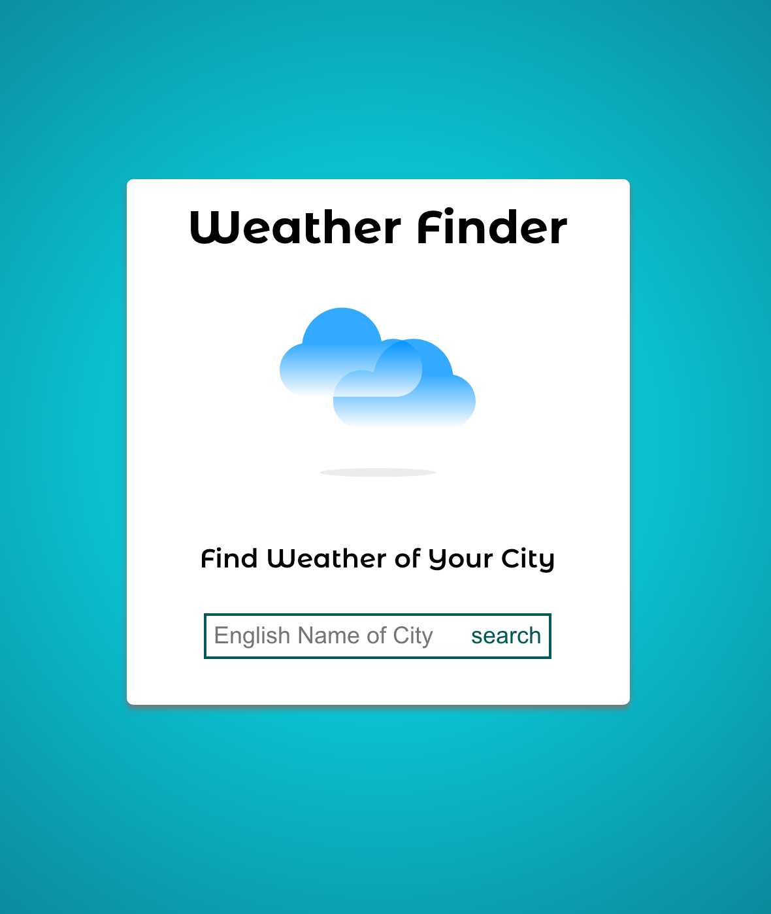
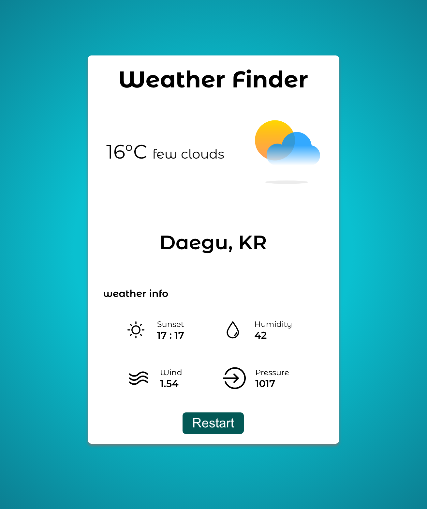

# React-Weather-App

This is to practice 2 skills,

1. How to handle the weather api with React.js using `axios`
2. To practice the `styled-components`

# Live

https://chwonseok.github.io/react-weather-app/

# Skills

React, styled-components

# Update History

- 2021.11.18. - mobile view 완성
- 2021.10.18. - pc view 완성
